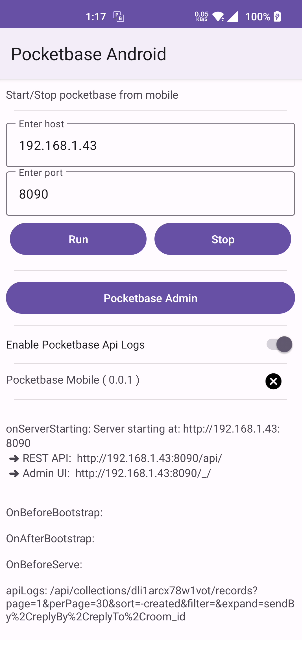

# Pocketbase Mobile

[](https://jitpack.io/#rohitsangwan01/pocketbase_mobile)

Pocketbase mobile is used to generate android and ios packages for using pocketbase in mobiles

## To build

Make sure [gomobile](https://pkg.go.dev/golang.org/x/mobile/cmd/gomobile) is installed

run : `gomobile bind -androidapi 19` for Android, this will generate `pocketbaseMobile.aar`, import this in android and use

run : `gomobile bind --target ios` for IOS or try : `gomobile bind -ldflags='-extldflags=-libresolv.tbd' -target=ios`

# To use in Flutter

Checkout [pocketbase_server_flutter](https://github.com/rohitsangwan01/pocketbase_server_flutter)

## To use in Android

### Add it in your root build.gradle at the end of repositories:

```gradlew
allprojects {
  repositories {
     ...
     maven { url 'https://jitpack.io' }
  }
}
```

### Add the dependency

```gradlew
dependencies {
    implementation 'com.github.rohitsangwan01:pocketbase_mobile:Tag'
}
```

### Usage

Use CoroutineScope to call pocketbase methods ( import kotlin coroutines libraries)

```kotlin
private val uiScope = CoroutineScope(Dispatchers.Main + Job())
```

To start pocketbase

```kotlin
// use dataPath where app have write access, for example temporary cache path `context.cacheDir.absolutePath` or filePath
uiScope.launch {
    withContext(Dispatchers.IO) {
        PocketbaseMobile.startPocketbase(dataPath, hostname, port, enableApiLogs)
    }
}
```

To stop pocketbase

```kotlin
uiScope.launch {
    withContext(Dispatchers.IO) {
        PocketbaseMobile.stopPocketbase()
    }
}
```

To listen pocketbase events, and also handle custom api requests

`pocketbaseMobile` have two custom routes as well ,`/api/nativeGet` and `/api/nativePost`, we can
get these routes in this callback and return response from kotlin

```kotlin
PocketbaseMobile.registerNativeBridgeCallback { command, data ->
    this.runOnUiThread {
        // Update ui from here
    }
    // return response back to pocketbase
    "response from native"
}
```

## To use in IOS

Download `PocketbaseMobile.xcframework.zip` and extract, then add this to ios project,

If getting error related to `Undefined symbol`, Select `Build Phases` and in `Link Binary With Libraries` section, click on `+` button and search for `libresolv.tbd` and choose from result and click on Add

checkout [this](https://github.com/golang/go/issues/58416) for more info


# Screenshots

Checkout [Pocketbase Server Flutter](https://github.com/rohitsangwan01/pocketbase_server_flutter) for android and ios implementation in flutter


Checkout [Pocketbase Server Android](https://github.com/rohitsangwan01/pocketbase_server_android_example) for native android implementation




# Usecase

- To create a secure localChat server or maybe a file storage system or anything which provided by pocketBase
- To use an old android device as local server to host PocketBase
- To use a mobile app which is based on PocketBase, so we can simply run PocketBase server within mobile and show demo of our application, useful for someone who don't want to host pocketBase yet
- To use Pocketbase as a College project,and for students team who want to show demo of a mobile app but can't afford hosting or something , so all they have to do is , run pocketBase server from there mobile and their main app which is based on pocketBase is ready to use

# Extras

Checkout a Flutter chatApp built using pocketbase: [flutter_pocketbase_chat](https://github.com/rohitsangwan01/flutter_pocketbase_chat)
